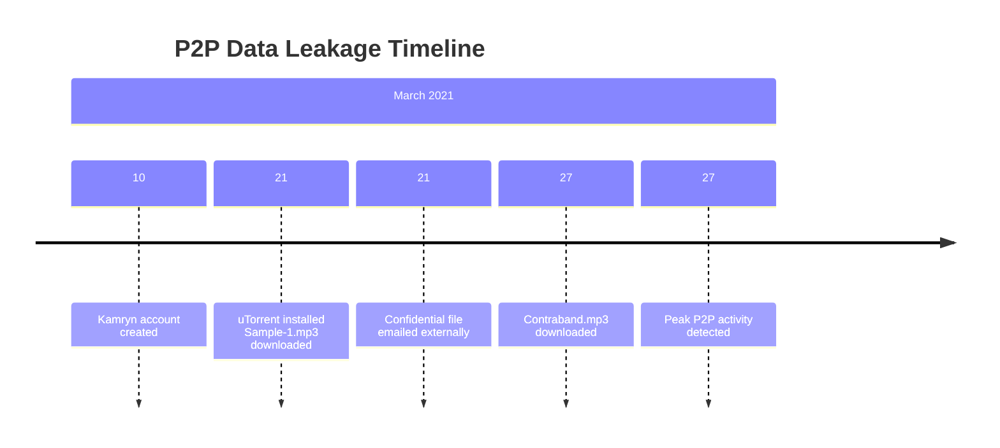

# Digital Forensics Lab: P2P Data Leakage Investigation


## 📋 Project Overview

This repository contains a comprehensive digital forensics investigation report documenting a P2P data leakage incident. The case involves the analysis of a Windows 10 system where a user engaged in unauthorized file-sharing activities and leaked confidential intellectual property.

**Case Number:** DF-2021-027  
**Investigation Period:** March 21-27, 2021  
**Subject:** User Kamryn - Unauthorized P2P Activities

## 🎯 Key Findings

### 🔥 Critical Discoveries
- **Unauthorized P2P Usage**: Installation and active use of uTorrent client
- **Confidential Data Theft**: Download of pre-release media files (`Sample-1.mp3`, `Contraband.mp3`)
- **Data Exfiltration**: Distribution of confidential files via email to external recipients
- **Policy Violations**: Multiple information security policy breaches

### 📁 Evidence Files
- **Disk Image**: `Disk_Image_ID-20210327.001` (MD5: `0adf1f182aab391d7042133bb55cf832`)
- **Memory Dump**: `Memory_Dump_ID-20210327.raw` (MD5: `eb74id12f54f57d4c1d5962bebb5771`)
- **Hash Reference**: `hash_reference.txt` containing verified file hashes

## 🛠️ Tools & Methodology

### Digital Forensics Tools Used
| Tool | Purpose | Version |
|------|---------|---------|
| **RegRipper** | Windows Registry Analysis | rip.pl with multiple plugins |
| **TSK Tools** | File System Analysis | fls, icat |
| **analyzeMFT** | MFT Parsing | Python script |
| **USN Journal Tools** | Change Tracking | usncarve.py, usn.py |
| **SQLite3** | Browser History Analysis | 3.46.1 |
| **ExifTool** | Metadata Extraction | 13.25 |
| **md5deep** | Hash Verification | - |

### Investigation Methodology
1. **Evidence Acquisition** - Disk imaging and verification
2. **File System Analysis** - MFT and USN journal examination
3. **Registry Analysis** - User activity and system configuration
4. **Timeline Analysis** - Event reconstruction
5. **Network Artifacts** - Browser history and download analysis
6. **Email Forensics** - Thunderbird mailbox examination

## 📊 Evidence Summary

### System Information
- **OS**: Windows 10 Home (Build 19041)
- **User**: Kamryn (Account created: 2021-03-10)
- **Computer**: DESKTOP-E4SUNT2
- **Timezone**: Pacific Standard Time

### P2P Activity Evidence
```bash
# uTorrent Installation Evidence
2021-03-21 20:39:08Z - uTorrent v.3.5.5.45852 installed

# Torrent Files Discovered
- Contraband.mp3.torrent (MD5: f140d5444122472342222953450e36d)
- Sample-1.mp3.torrent (MD5: 8ac86f7a2151250bc4033fde9e23456f)
```

### Confidential Files Identified
| File | MD5 Hash | Status | Confidentiality |
|------|----------|---------|----------------|
| `Sample-1.mp3` | `b387e8334b3db03d604cfa14511f6913` | Pre-release | HIGH |
| `Contraband.mp3` | `f9d82438ed446e43cbd06adf7dbc875b` | Suspected Illegal | MEDIUM |

### Email Evidence
**Critical Finding**: External distribution of confidential files
- **Sender**: willis.gibbs@outlook.com
- **Recipient**: camille123@outlook.com
- **Attachment**: Sample-1.mp3 (Confidential pre-release file)
- **Message**: "Sample to be presented at upcoming meeting"

## 📈 Timeline of Events



## 🚨 Conclusions

### Policy Violations Identified
1. **Unauthorized Software** - Installation of uTorrent without approval
2. **Data Theft** - Downloading confidential intellectual property
3. **Data Leakage** - Distribution to external parties
4. **Concealment Attempts** - Files hidden in AppData with backups

### Impact Assessment
- **HIGH**: Loss of confidential intellectual property
- **HIGH**: Potential legal and commercial consequences
- **MEDIUM**: Network security compromise
- **LOW**: System integrity maintained

## 🛡️ Security Recommendations

### Immediate Actions
- [ ] Disable user account Kamryn
- [ ] Secure and preserve evidence
- [ ] Block P2P traffic at network perimeter

### Technical Controls
- [ ] Implement DLP (Data Loss Prevention) system
- [ ] Enhance application whitelisting
- [ ] Deploy network monitoring for P2P traffic

### Organizational Measures
- [ ] Conduct security awareness training
- [ ] Review and update information security policies
- [ ] Implement employee monitoring protocols

## 📁 Repository Structure

```
digital-forensics-lab/
├── 📄 P2P_Leakage_Report.html          # Complete investigation report
├── 📁 Evidence/
│   ├── hash_reference.txt              # File hash verification data
│   └── command_outputs.pdf             # Raw command outputs
├── 📁 Scripts/
│   ├── registry_analysis/              # RegRipper scripts
│   └── timeline_tools/                 # MFT and USN analysis
└── 📁 Documentation/
    ├── methodology.md                  # Investigation methodology
    └── tools_guide.md                  # Forensics tools reference
```

## 🎓 Learning Objectives

This case study demonstrates:
- P2P forensic investigation techniques
- Windows registry analysis
- Email forensics procedures
- Timeline analysis and reconstruction
- Evidence documentation and reporting

## ⚖️ Legal & Ethical Considerations

- All investigation conducted following proper forensic procedures
- Evidence handled with chain of custody protocols
- Privacy considerations maintained throughout
- Report prepared for legitimate investigative purposes

## 🤝 Contributing

This is an educational case study. For suggestions or improvements:
1. Fork the repository
2. Create a feature branch
3. Submit a pull request with detailed explanation

## 📄 License

This project is intended for educational purposes as part of digital forensics training.

## 📞 Contact

**Digital Forensics Lab**  
*Professional Forensic Investigation Services*

---

*This report contains sensitive information - handle appropriately and ensure proper authorization before distribution.*
